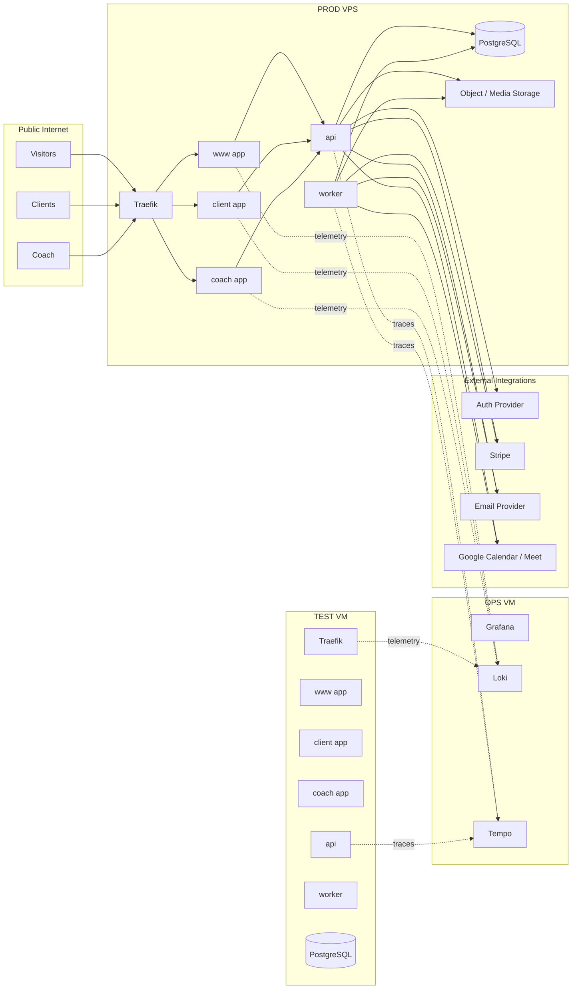

# Architecture

## Status

This document captures the current target architecture for the coaching platform.

It is a living reference, not a frozen contract. The product model, PRD, and design reference app are still evolving, so this document focuses on:

- decisions that are already intentional
- the reasoning behind those decisions
- system boundaries that should remain stable
- implementation guardrails for engineers and AI agents

This document should be updated when architecture intent changes in a meaningful way.

## Product Context

The product has three major surfaces with equal business importance:

- a public marketing experience: landing page, blog, public digital store
- a client portal: authenticated, mobile-friendly, installable as a PWA
- a coach portal: authenticated, operationally richer, installable as a PWA

The repository also contains a design reference app under `designs/react-reference-app`.

That app is not part of the production product stack. It exists only as a design and interaction reference and is deployed to TEST only on a static route for inspection.

The public experience acquires customers.
The private experiences retain them.

This means the architecture must support both:

- strong SEO, public performance, and content delivery
- rich application behavior, authenticated workflows, and durable business logic

## Primary Drivers

The architecture is optimized for these priorities:

- self-hosted infrastructure before managed-cloud dependence
- low ongoing operating cost
- installable client and coach apps as PWAs
- good long-term support without quickly becoming legacy
- strong developer experience with low framework friction
- strict separation between public, client, and coach code paths
- safe deploys with TEST-first validation and manual PROD promotion
- near-zero-downtime deployments for stateless services
- shared types and validation between apps and backend

## Chosen Direction

The current target architecture is:

- frontend framework: React Router v7 Framework Mode
- runtime language: TypeScript across frontend, API, and worker
- build/workspace model: monorepo with workspace packages
- deployment model: Docker Compose on self-managed VMs
- edge proxy: Traefik
- database: PostgreSQL in a sibling container on the same host
- environments:
  - TEST VM on home server
  - OPS VM on home server
  - PROD VPS, likely Hetzner
- network/admin plane: Tailscale
- observability: Grafana, Loki, Tempo on OPS VM
- TEST/PROD secret ownership: `terraform-infra`
- local-development runtime secret templates and work files also live under `terraform-infra/secrets`

## Tooling Baseline

Recommended baseline:

- Node.js `22.22.2` as the CI, Docker, and preferred local baseline via `.node-version`
- TypeScript
- pnpm `10.33.0`
- pnpm workspaces with catalogs and injected workspace packages
- React Router v7 Framework Mode
- Vite `7.3.x`
- Docker Compose v2

This baseline is intended to keep the development model consistent across:

- frontend apps
- API
- worker
- shared packages

Tooling should stay boring and well-supported. Avoid introducing extra build systems unless a concrete need appears.

## Monorepo Tooling Rationale

### Why pnpm Workspaces

`pnpm workspaces` is the default monorepo package-management model for this project.

It is chosen because it provides:

- a lightweight monorepo foundation without adopting a large orchestration platform too early
- fast installs and good disk efficiency
- explicit shared-package boundaries
- strong TypeScript monorepo ergonomics
- good compatibility with Docker-based builds
- lower lock-in than heavier monorepo frameworks

This project does not need Nx or Turborepo on day one.

Workspace package management uses the latest pnpm patterns that fit this repo:

- a single root `packageManager` pin
- shared dependency versions via `catalog`
- `injectWorkspacePackages: true` so `pnpm deploy` can use the current non-legacy workflow
- `allowBuilds` for explicit build-script allowlisting instead of broad postinstall trust
- `cleanupUnusedCatalogs: true` to keep the catalog surface tidy

Those tools remain future options if build orchestration, caching, or task graph complexity eventually justify them.

For now, the intended progression is:

1. start with pnpm workspaces
2. keep scripts simple and explicit
3. add heavier monorepo tooling only if the repo proves it needs it

### Why Vite

`Vite` is the chosen bundler and frontend build tool.

It is chosen because it is the most natural fit for this stack:

- modern React applications
- React Router v7 Framework Mode
- TypeScript monorepo development
- fast local startup and rebuild speed
- low conceptual overhead

This project does not need a custom bundler strategy.

The intended default is:

- use Vite unless a concrete technical reason appears to change it
- avoid adding bundler-specific complexity early
- keep Vite on the latest version officially supported by the current React Router release line

## Why React Router v7 Framework Mode

React Router v7 Framework Mode was chosen because it best matches the combination of:

- self-hosting preference
- low-friction developer experience
- long-term architectural stability
- route-level code splitting
- SSR and pre-rendering support
- a routing model that is already close to the current design reference app

It is a better fit for this product than:

- Next.js, which offers more built-in marketing-site conventions but introduces more framework-specific behavior and learning overhead
- Go + templ + HTMX + Alpine, which would add significant friction for the highly interactive client and coach experiences

React Router v7 is not chosen because it is simpler in the abstract. It is chosen because, for this product, it offers the best balance of:

- explicitness
- durability
- VPS-friendliness
- app-like UX support

## Why Three Separate Frontend Apps

The architecture uses three separate React Router apps instead of one large app:

- `www`
- `client`
- `coach`

This is intentional.

These are not just sections of one website. They are different products with different requirements:

- `www` is SEO-first, content-first, and public
- `client` is auth-gated, mobile-optimized, and PWA-first
- `coach` is auth-gated, workflow-heavy, and more desktop/tablet oriented

Splitting them provides:

- clean bundle separation
- separate PWA manifests, names, icons, and service workers
- lower blast radius during deploys
- clearer auth boundaries
- simpler rendering strategy per surface
- less risk of accidentally shipping unrelated code

Tradeoff:

- more deployables
- more shared-package discipline
- more CI/CD wiring

That tradeoff is worth it because the product boundaries are real and likely to remain real.

## Design Reference App

The design reference app is intentionally separate from the production application stack.

It exists to:

- preserve the evolving design reference
- make flows reviewable in TEST
- keep implementation work decoupled from the mock frontend

It does not:

- share runtime code with the production apps
- deploy to PROD
- participate in business logic or backend contracts

Deployment shape:

- built as a static Vite app
- exposed only in TEST
- routed behind Traefik on a dedicated static path

## Why a Separate API

The frontend apps do not own business rules.

The API exists because the same core rules must be enforced consistently across:

- public commerce flows
- client workflows
- coach workflows
- scheduled/background jobs

Without a shared API, the same rules would be duplicated across multiple frontend apps.

The API is the single backend authority for:

- authentication and authorization integration
- input validation and business rules
- database transactions
- state transitions
- audit logging
- webhook handling
- job creation

## Why Node.js and TypeScript for the API

The API and worker use Node.js and TypeScript because the platform’s core complexity is business workflow coordination, not heavy compute.

Using TypeScript end-to-end provides:

- shared validation schemas
- shared DTOs and event payloads
- shared domain helpers
- lower context switching
- faster iteration while the domain is still changing

This is especially important because the PRD and data model are not final yet.

Go remains a reasonable future option for specific services if a clear need appears, but it is not the best starting point for this phase of the product.

## Why a Worker Exists

The worker exists so the API can stay fast and predictable.

The API should:

- validate
- apply business rules
- write to the database
- return quickly

The worker should handle slower or retryable side effects, such as:

- invite emails
- order emails
- push notification fan-out
- recurring check-in generation
- Stripe webhook side effects
- cleanup jobs
- reminder jobs
- future media processing

The worker is a separate runtime process, but not a separate backend stack. It shares code with the API.

This keeps:

- request latency lower
- retries safer
- integrations more resilient
- side effects easier to reason about

## System Overview



## Monorepo Shape

Recommended structure:

```text
/apps
  /www
  /client
  /coach
  /api
  /worker

/packages
  /ui
  /design-tokens
  /domain
  /db
  /auth
  /contracts
  /http-client
  /config
  /content
```

### Apps

`apps/www`

- public landing page
- blog
- public digital store
- booking flow
- token-gated coaching purchase flow
- SSR + pre-rendering heavy

`apps/client`

- authenticated client portal
- installable PWA
- SSR first load + hydrated app behavior
- optimized for mobile

`apps/coach`

- authenticated coach portal
- installable PWA
- SSR first load + richer interactive UI
- optimized for desktop/tablet

`apps/api`

- shared backend authority
- internal business rules
- REST + SSE
- webhook entrypoints

`apps/worker`

- background jobs
- retryable side effects
- scheduled jobs

### Packages

`packages/ui`

- shared React UI primitives
- shared component styling patterns
- design-system-aligned shared widgets

`packages/design-tokens`

- typography tokens
- color tokens
- spacing/radius/shadow tokens
- cross-app design constants

`packages/domain`

- domain models
- domain services
- event names
- business invariants

`packages/db`

- database connection helpers
- migrations
- query modules
- transaction helpers

`packages/auth`

- auth-provider abstraction
- session helpers
- role resolution
- route guards

`packages/contracts`

- Zod schemas
- request/response payload contracts
- event payload contracts
- shared validation

`packages/http-client`

- typed API client helpers
- fetch wrappers
- SSE clients

`packages/config`

- shared runtime config parsing
- environment validation

`packages/content`

- blog content or content source adapters

## Frontend Application Strategy

### `www`

Primary purpose:

- acquisition
- SEO
- authority and trust
- digital product conversion

Rendering strategy:

- SSR for dynamic/public content where needed
- pre-render key routes wherever practical

Expected route families:

- `/`
- `/pricing`
- `/store`
- `/store/:slug`
- `/blog`
- `/blog/:slug`
- `/book`
- `/select-bundle`

### `client`

Primary purpose:

- delivery of coaching experience
- retention
- client messaging and plan consumption

Rendering strategy:

- SSR for first response
- hydrated client app after load
- PWA install flow enabled

Expected route families:

- `/`
- `/messages`
- `/plan`
- `/workout/:planId/:weekIdx/:dayIdx`
- future progress/logging routes

### `coach`

Primary purpose:

- operations
- onboarding
- training program creation
- client management

Rendering strategy:

- SSR for first response
- hydrated app for rich workflows
- PWA install flow enabled
- heavy screens lazy-loaded aggressively

Expected route families:

- `/`
- `/clients`
- `/clients/:id`
- `/messages`
- `/training`
- `/training/template-builder`
- `/training/builder/:clientId`
- `/checkins`
- `/onboard`

## Backend Strategy

### API

The API should be intentionally thin at the transport layer and strong at the domain layer.

Recommended stack:

- Node.js LTS
- TypeScript
- Fastify
- `pg`
- `zod`

Responsibilities:

- auth/session verification
- authz
- validation
- domain orchestration
- transaction boundaries
- SSE endpoints
- webhooks
- emitting outbox/jobs

The API should not contain frontend-specific rendering logic.

### Worker

Recommended stack:

- Node.js LTS
- TypeScript
- shared packages from the monorepo

Responsibilities:

- poll/claim jobs from Postgres-backed outbox/jobs table
- retry with backoff
- mark success/failure
- emit operational telemetry

The worker should be treated as part of the backend system, not as a separate product.

## Data and Persistence Strategy

### PostgreSQL

PostgreSQL is the system of record.

Initial hosting decision:

- Postgres runs as a sibling container on the same VM as the app containers
- persistent data uses named Docker volumes
- backups are mandatory

This is acceptable for the current scale and cost posture.

### Schema Philosophy

The schema is intentionally not fully specified yet because the product is still evolving.

Stable expectations:

- database constraints should enforce important business rules whenever possible
- application logic should not be the only protection for critical invariants
- schema migrations should be additive-first and safe for rolling app deploys

Examples of rule types likely to be enforced at the DB level:

- one active plan per client
- one pending ad-hoc check-in per client
- unique token records for gated purchases/invites
- audit/event records

### Job / Outbox Pattern

The worker should be fed by a Postgres-backed jobs or outbox table.

Pattern:

1. API transaction writes business data
2. Same transaction writes job/outbox record
3. Worker claims and processes pending work

Benefits:

- transactional safety
- no extra queue service on day one
- simpler self-hosted operations

## Realtime and Notifications Strategy

Start simple.

Recommended initial approach:

- REST for standard reads/writes
- SSE for server-to-client events
- Web Push for background notifications in client and coach PWAs

Do not start with WebSockets unless a real need appears for:

- typing indicators
- presence
- richer low-latency collaboration

## PWA Strategy

PWAs are enabled for:

- `client`
- `coach`

PWAs are not the primary mode for `www`.

Each PWA should have its own:

- subdomain
- manifest
- icon set
- app name
- theme color
- service worker
- install prompt UX
- notification configuration

This separation is one of the main reasons `client` and `coach` are deployed as distinct apps.

## Networking and Infrastructure

### Environments

`OPS`

- hosts Grafana, Loki, Tempo
- private over Tailscale

`TEST`

- pre-production validation environment
- Traefik in front
- reachable through Tailscale
- automatic deployment target after merge to `main`

`PROD`

- likely Hetzner VPS
- Traefik in front
- public ingress on `80/443`
- admin over Tailscale

### Reverse Proxy

Traefik is the chosen reverse proxy because:

- it already matches the existing infra direction
- it works naturally with Docker Compose
- it supports dynamic routing well
- it supports the planned cutover strategy cleanly

Nginx is not rejected in general. Traefik is simply the better fit for this multi-app, Docker-based environment.

### Runtime

Docker Compose is the chosen runtime model because:

- it fits Traefik naturally
- it is easy to reproduce across TEST and PROD
- it keeps service boundaries explicit
- it is a better operational fit than bare systemd services for this multi-container app stack

## CI/CD Strategy

### Source of Truth

Infrastructure intent already points to this deployment model:

- build once
- push immutable image
- deploy to TEST first
- manually promote exact digest to PROD

This document adopts that model for the application repository as well.

### CI

The CI workflow follows the current GitHub Actions and Docker official-action model:

- `actions/checkout`
- `actions/setup-node`
- `pnpm/action-setup`
- `docker/login-action`
- `docker/setup-buildx-action`
- `docker/build-push-action`
- `aquasecurity/trivy-action`
- `tailscale/github-action`

Action majors should be kept current through Dependabot, and JavaScript actions are pinned to the Node 24 runtime path via workflow environment configuration.
Dependabot should monitor both the workspace root and the isolated design reference app because they use separate lockfiles.

On pull requests:

1. install dependencies
2. typecheck
3. build the application workspace
4. build the TEST-only design reference app

On pushes to `main`:

1. install dependencies
2. typecheck
3. build the application workspace
4. build Docker images with `docker/build-push-action`
5. push immutable images to GHCR
6. publish a release manifest artifact containing the image digests
7. run a container security gate before deploy

Images must be tagged with:

- git SHA
- optional release tag

Runtime image rules:

- frontend images use `pnpm deploy` with injected workspace packages so the runtime layer contains only the app package and production dependencies
- API and worker images bundle their runtime entrypoints during build so the final image does not need `tsx` or the workspace dev toolchain
- Dockerfiles use a pinned Node image tag rather than floating on `latest`

### CD to TEST

Trigger:

- merge to `main`

Flow:

1. use the image digest built by CI
2. connect to TEST via Tailscale-only SSH
3. authenticate the target host to GHCR for pull-by-digest when needed
4. deploy inactive color
5. run safe/additive migrations
6. wait for readiness and health checks
7. cut traffic to new color
8. run smoke checks
9. keep previous color briefly for rollback

Release artifact:

- CI publishes an image-set manifest artifact that records the exact digest refs for `www`, `client`, `coach`, `api`, `worker`, and the TEST-only design reference image
- deploy automation consumes the exact digest refs produced by the build job

TEST route shape:

- `https://<test-host>/eli-coach-platform/`
- `https://<test-host>/eli-coach-platform/client`
- `https://<test-host>/eli-coach-platform/coach`
- `https://<test-host>/eli-coach-platform/api`
- `https://<test-host>/eli-coach-platform/design-reference`

Runtime secret source:

- TEST runtime env files are provisioned and synced by `terraform-infra`
- this repository only verifies that those files already exist on the target host
- this repository does not generate or encrypt TEST runtime app secrets

### CD to PROD

Trigger:

- manual approval workflow after TEST validation

Approval mechanism:

- use GitHub Actions environments with required reviewers for production promotion

Flow:

1. promote the exact image digest already tested in TEST
2. connect to PROD via Tailscale-only SSH
3. perform the same cutover process
4. rollback by switching traffic back to previous color if needed

Runtime secret source:

- PROD runtime env files are provisioned and synced by `terraform-infra`
- this repository consumes the runtime contract only
- runtime secret creation is intentionally outside the application repository

### Deployment Invariant

Do not rebuild for PROD.

TEST and PROD must run the same image digest.

## Zero-Downtime Deployment Strategy

### Goal

Provide near-zero-downtime deployments for stateless user-facing services.

### Mechanism

Use single-host blue/green deployments per environment.

Colorized services:

- `www`
- `client`
- `coach`
- `api`

Singleton services:

- `traefik`
- `worker`
- `postgres`
- telemetry agents

Flow:

1. active color stays live
2. inactive color is deployed in parallel
3. health checks pass
4. Traefik routing flips to inactive color
5. previous color remains available for rollback
6. old color is removed after validation window

### What Zero-Downtime Does Not Mean

It does not mean:

- zero downtime during host failure
- zero downtime for destructive DB migrations
- zero downtime for Postgres restarts

On a single VPS, this is `application cutover without visible interruption`, not full high-availability architecture.

### Database Migration Rule

Use expand/contract migrations:

- additive schema change first
- app rollout second
- cleanup/removal later

This is required to keep deployments safe.

## Observability

Current observability home is the OPS VM.

Use:

- Grafana
- Loki
- Tempo

Applications should emit:

- structured logs
- traces for major workflows
- metrics for request volume, latency, errors, and key business events

Important traces and metrics should cover:

- auth flows
- booking flow
- store checkout flow
- plan assignment
- messaging events
- check-in scheduling events
- webhook processing
- worker job outcomes

## Auth Strategy

Initial recommendation:

- use a managed auth provider, likely Clerk
- wrap it behind `packages/auth`

Why:

- lower initial friction
- faster product progress
- ability to keep auth-provider-specific details isolated

This is an intentionally swappable boundary.

If self-hosted auth becomes a stronger requirement later, the system should be able to evolve without rewriting every application.

## Third-Party Integrations

These are the expected major integrations.

Some are decided, some are initial recommendations.

### Core Infrastructure / Delivery

- GHCR for container registry
- GitHub Actions for CI/CD
- Traefik for reverse proxy
- Tailscale for admin and CI connectivity
- Cloudflare for DNS
- Hetzner for the likely production VPS

### Product Integrations

- Auth provider, initially recommended: Clerk
- Payments: Stripe
- Email provider, initially recommended: Resend or equivalent transactional email provider
- Calendar integration: Google Calendar / Google Meet
- Media storage: S3-compatible object storage or a local-volume-backed abstraction depending cost/ops tradeoffs

### Observability Integrations

- Grafana
- Loki
- Tempo

## Dependency Policy

The platform should stay intentionally lean.

Guidelines:

- prefer built-in platform capabilities over large abstractions
- prefer small focused libraries over large framework-on-framework stacks
- avoid unstable or experimental features in production
- minimize dependencies that create long-term lock-in

### Safe-by-default choices

- stable React Router v7 Framework Mode features only
- no unstable React Router APIs in production
- no React Server Components experiments
- no unnecessary state-management framework unless the app later proves it is needed
- no heavy ORM unless it solves a problem the team actually has

## Engineering Guardrails

These rules should stay true as the codebase grows.

### Business Rules

- business rules live in shared domain/backend code, not only in the frontend
- frontend apps should not each invent their own domain logic
- important invariants should be enforced at the database level where reasonable

### Shared Contracts

- validate all external input
- use shared schemas for API contracts
- keep request/response/event payloads typed and version-conscious

### Frontend Boundaries

- `www` should not depend on coach-only or client-only app code
- `client` should not depend on coach-only workflows
- `coach` should not depend on public marketing code
- shared UI belongs in packages, not cross-imported ad hoc between apps

### Runtime Boundaries

- API owns request-time state changes
- worker owns retryable and asynchronous side effects
- Postgres is the source of truth
- Traefik owns ingress and cutover routing

### Deployment Boundaries

- TEST is mandatory before PROD
- PROD deploys are manual approval only
- same image digest must move from TEST to PROD
- deploys must be health-gated

### Security Boundaries

- no public SSH required
- secrets must not be baked into images
- runtime secrets are environment-specific
- local development secrets live in this repository's ignored work tree
- TEST and PROD runtime secrets are owned by `terraform-infra`
- CI deploy credentials are distinct from application runtime secrets
- telemetry must avoid high-cardinality PII labels

## AI Agent Guidance

When AI agents or engineers work in this repo, they should assume:

- this architecture is the target direction unless the user explicitly changes it
- schema details are still evolving, so avoid prematurely overfitting the database design
- boundaries matter more than implementation details at this phase

Agents should prefer:

- adding code to shared packages when logic truly belongs there
- keeping business rules centralized
- keeping public/client/coach concerns separated
- documenting architecture changes when they alter system boundaries or deployment assumptions

Agents should avoid:

- introducing unstable framework features
- pulling business logic into frontend-only state containers
- coupling application code to a single auth provider everywhere
- hard-coding environment-specific infrastructure assumptions into app logic

## Future Evolution

These are expected future improvements, not current requirements.

- second production host for stronger blue/green and higher availability
- moving Postgres to a dedicated node or managed/self-hosted separate service
- stronger object-storage/media pipeline
- more advanced job execution strategy if load justifies it
- optional auth-provider swap if self-hosting becomes more important

## Open Decisions Intentionally Deferred

These are not finalized yet and should not be prematurely over-designed:

- final DB schema
- exact product content model for blog/store details
- exact object storage choice
- exact auth provider final decision
- final analytics/product event taxonomy
- eventual offline scope for PWAs

## Summary

This architecture is designed to be:

- self-hosted
- cost-aware
- explicit
- stable
- friendly to long-term maintenance

The core shape is:

- three React Router frontend apps
- one shared API
- one worker
- PostgreSQL
- Traefik
- Docker Compose
- TEST-first deployments
- manual PROD promotion
- blue/green cutover for stateless services

That is the current starting point for building the platform.
